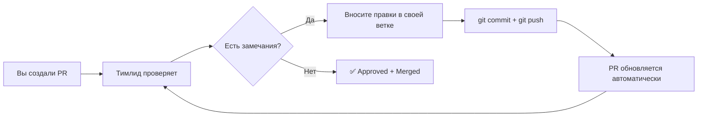
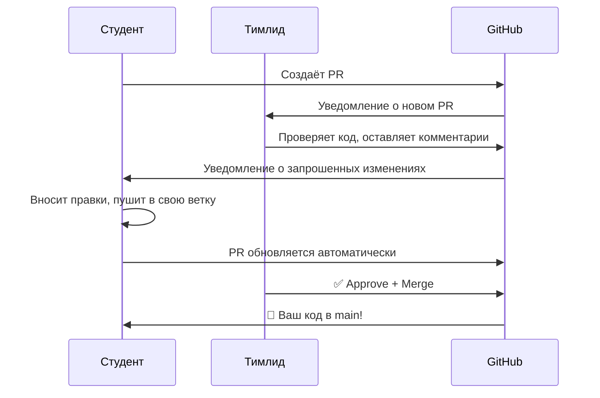

\# 🎓 Инструкция для Студента-разработчика  
> **EventBridge 2.0 — Микросервисная архитектура с RabbitMQ**

Вы — владелец своего модуля. Вы работаете в своей «песочнице» (ветке) и предлагаете свои изменения команде через **Pull Request**.

---

## 📋 Оглавление
1. [🚀 Быстрый старт](#-быстрый-старт)
2. [🌿 Работа с ветками](#-работа-с-ветками)
3. [💻 Разработка модуля](#-разработка-модуля)
4. [📤 Отправка работы на проверку](#-отправка-работы-на-проверку)
5. [🔁 Ревью и доработки](#-ревью-и-доработки)
6. [🐳 Запуск всей системы: Docker Compose](#-запуск-всей-системы-docker-compose)
7. [📦 Пример реализации: `email-service`](#-пример-реализации-email-service)
8. [✅ Чек-лист перед отправкой PR](#-чек-лист-перед-отправкой-pr)
9. [❓ FAQ: Merge и конфликты](#-faq-merge-и-конфликты)

---

## 🚀 Быстрый старт

### Шаг 1: Подготовка рабочего пространства *(делается один раз)*

```bash
# 1. Клонируйте репозиторий
git clone <URL_репозитория>

# 2. Перейдите в папку проекта
cd event-bridge-project

# 3. Создайте и активируйте виртуальное окружение
python -m venv venv

# Для macOS/Linux:
source venv/bin/activate

# Для Windows (PowerShell):
.\venv\Scripts\Activate.ps1

# Для Windows (CMD):
venv\Scripts\activate

# 4. Установите зависимости
pip install -r requirements.txt
```

> ⚠️ **Важно:** Файл `.env` с секретами **никогда** не коммитьте в репозиторий! Он уже добавлен в `.gitignore`.

---

## 🌿 Работа с ветками

### Шаг 2: Создание своей ветки

```bash
# 1. Всегда начинайте с обновления main!
git checkout main
git pull origin main

# 2. Создайте личную ветку для вашего модуля
# Формат: feature/<название-вашего-модуля>
git checkout -b feature/email-service
```

| Формат ветки | Пример | Описание |
|--------------|--------|----------|
| `feature/<module>` | `feature/email-service` | Новый функционал |
| `fix/<module>` | `fix/database-connection` | Исправление бага |
| `docs/<module>` | `docs/add-readme` | Обновление документации |

> ✅ Теперь вы в своей ветке. Здесь вы можете экспериментировать, не боясь сломать работу других.

---

## 💻 Разработка модуля

### Шаг 3: Пишем код

1. **Создайте папку для сервиса** (например, `email_service/`)
2. **Структура файлов внутри:**
   ```
   email_service/
   ├── main.py           # Основная логика
   ├── config.py         # Конфигурация из .env
   ├── requirements.txt  # Зависимости сервиса
   └── README.md         # Инструкция по запуску
   ```

3. **Коммитьте часто!** Как только сделали небольшую, но законченную часть:
   ```bash
   git add email_service/main.py
   git commit -m "feat: implement email sending logic"
   ```

### 📝 Конвенция коммитов

| Префикс | Когда использовать | Пример |
|---------|-------------------|--------|
| `feat:` | Новый функционал | `feat: add RabbitMQ consumer` |
| `fix:` | Исправление бага | `fix: correct SMTP port` |
| `docs:` | Документация | `docs: add README for email service` |
| `refactor:` | Улучшение кода без изменений логики | `refactor: extract send_email function` |
| `chore:` | Вспомогательные задачи | `chore: update requirements.txt` |

---

## 📤 Отправка работы на проверку

### Шаг 4: Создаём Pull Request

```bash
# 1. Отправьте ветку на GitHub
git push origin feature/email-service
```

2. **Зайдите на GitHub** → вы увидите жёлтую плашку `Compare & pull request` → нажмите её.

3. **Заполните форму PR:**

| Поле | Что писать | Пример |
|------|-----------|--------|
| **Title** | Кратко и ясно | `Feature: Email Confirmation Service` |
| **Description** | Подробно, с чек-листом | См. шаблон ниже 👇 |

#### 📋 Шаблон описания PR
```markdown
## 📌 Что реализовано
- [ ] Подключается к RabbitMQ и слушает `email_queue`
- [ ] Отправляет email через SMTPLIB
- [ ] Реализована обработка ошибок и `basic_ack`
- [ ] Добавлен `README.md` с инструкцией

## 🧪 Как тестировать
1. Запустить сервис: `python email_service/main.py`
2. Отправить тестовое событие через `test_publisher.py`
3. Проверить получение письма на `test@example.com`

## 📸 Логи/Скриншоты
<!-- Вставьте вывод консоли или скриншот успешной отправки -->
```

4. Нажмите **`Create pull request`** 🎉

---

## 🔁 Ревью и доработки

### Шаг 5: Работа с комментариями



1. Если запрошены изменения (**Changes requested**):
   ```bash
   # Внесите исправления в коде
   git add .
   git commit -m "fix: apply review comments"
   git push origin feature/email-service
   # ✅ PR обновится сам, создавать новый не нужно!
   ```

2. Напишите в комментариях к PR:
   > `@<имя_тимлида> Готово, можно проверять снова` 👀

3. Когда PR **Approved** и **Merged** — ваша работа принята! 🎊

---

## 🐳 Запуск всей системы: Docker Compose

> 💡 **Промышленный стандарт** — описывайте всю инфраструктуру в одном файле.

### Преимущества
| Преимущество | Почему это важно |
|--------------|-----------------|
| 🔒 Полная изоляция | Никаких конфликтов версий Python или библиотек |
| 📦 Вся система в одном файле | Декларативное описание архитектуры |
| ⚡ Одна команда для всего | `docker-compose up` запускает **всё**, включая RabbitMQ |

### Пример `docker-compose.yml`
```yaml
version: '3.8'

services:
  # 🐇 Наша "нервная система"
  rabbitmq:
    image: rabbitmq:3-management
    container_name: eventbridge_rabbitmq
    ports:
      - "5672:5672"   # AMQP
      - "15672:15672" # Web UI
    environment:
      RABBITMQ_DEFAULT_USER: guest
      RABBITMQ_DEFAULT_PASS: guest

  # 🔑 Redis для аналитики
  redis:
    image: redis:7-alpine
    container_name: eventbridge_redis
    ports:
      - "6379:6379"

  # 🌐 API Gateway
  api:
    build: ./api_gateway_service
    container_name: api_gateway
    ports:
      - "8000:8000"
    depends_on:
      - rabbitmq
    env_file:
      - .env

  # 📧 Email Service
  email_service:
    build: ./email_service
    container_name: email_service
    depends_on:
      - rabbitmq
    env_file:
      - .env

  # ➕ Добавьте остальные 8 сервисов по аналогии...
```

### Полезные команды
```bash
# Запустить всё в фоновом режиме
docker-compose up -d

# Посмотреть логи всех сервисов
docker-compose logs -f

# Остановить и удалить контейнеры
docker-compose down

# Пересобрать и запустить заново
docker-compose up -d --build
```

> 🔗 **Доступ к RabbitMQ UI:** `http://localhost:15672` (логин/пароль: `guest`/`guest`)

---

## 📦 Пример реализации: `email-service`

### 1. Структура папок
```
event-bridge-project/
├── .env                  # Секреты (в .gitignore!)
├── docker-compose.yml
├── requirements.txt      # Общие зависимости
└── email_service/
    ├── main.py           # Основная логика
    ├── config.py         # Конфигурация
    ├── requirements.txt  # Зависимости сервиса
    └── README.md         # Документация
```

### 2. Конфигурация (БЕЗ паролей в коде! 🔐)

#### Файл `.env` (в корне проекта)
```env
# 🐇 RabbitMQ
RABBITMQ_HOST=localhost

# 📧 Email Service
EMAIL_SENDER_ADDRESS=your_email@gmail.com
EMAIL_SENDER_PASSWORD=your_google_app_password  # ← Не обычный пароль!
SMTP_HOST=smtp.gmail.com
SMTP_PORT=465
```

#### Файл `email_service/config.py`
```python
import os
from dotenv import load_dotenv

# Загружаем переменные из .env
load_dotenv()

# 🐇 RabbitMQ
RABBITMQ_HOST = os.getenv("RABBITMQ_HOST", "localhost")
QUEUE_NAME = "email_queue"

# 📧 Email
EMAIL_SENDER = os.getenv("EMAIL_SENDER_ADDRESS")
EMAIL_PASSWORD = os.getenv("EMAIL_SENDER_PASSWORD")
SMTP_HOST = os.getenv("SMTP_HOST", "smtp.gmail.com")
SMTP_PORT = int(os.getenv("SMTP_PORT", 465))
```

#### Файл `email_service/requirements.txt`
```txt
pika>=1.3.0
python-dotenv>=1.0.0
```

### 3. Основная логика `email_service/main.py`
```python
import pika
import json
import smtplib
import time
from email.mime.text import MIMEText
import config

def send_confirmation_email(data: dict) -> bool:
    """Формирует и отправляет email-подтверждение."""
    recipient = data.get('user_email')
    if not recipient:
        print(" [!] Ошибка: отсутствует 'user_email'")
        return False

    subject = f"Подтверждение регистрации на {data.get('event_name', 'событие')}"
    body = (
        f"Здравствуйте, {data.get('user_name', 'участник')}!\n\n"
        f"Вы успешно зарегистрированы на '{data.get('event_name')}'.\n"
        f"ID регистрации: {data.get('registration_id')}"
    )

    msg = MIMEText(body)
    msg['Subject'] = subject
    msg['From'] = config.EMAIL_SENDER
    msg['To'] = recipient

 ...
```

### 4. Документация `email_service/README.md`
```markdown
# 📧 Email Service

Сервис отправки подтверждений регистрации.

## 🔧 Настройка

1. Убедитесь, что в корне проекта есть файл `.env` с переменными:
   ```env
   EMAIL_SENDER_ADDRESS=your_email@gmail.com
   EMAIL_SENDER_PASSWORD=your_app_password
   ```

2. > ⚠️ **Важно:** `EMAIL_SENDER_PASSWORD` — это **пароль приложения Google**, 
   а не пароль от аккаунта. 
   [Как создать](https://support.google.com/accounts/answer/185833)

## 🚀 Запуск

```bash
# Из корня проекта:
python email_service/main.py
```

## 🧪 Тестирование

```bash
# Отправьте тестовое событие:
python test_publisher.py --queue email_queue --vip false
```
```

---

## ✅ Чек-лист перед отправкой PR

> Прежде чем создавать Pull Request, ответьте **ДА** на все вопросы:

### 📁 Структура
- [ ] Код находится в отдельной папке (`email_service/`, а не в корне)?
- [ ] Есть файл `requirements.txt` именно для этого сервиса?
- [ ] Создан `README.md` с инструкцией по запуску?

### 🔐 Безопасность
- [ ] Все пароли, адреса и секреты вынесены в `config.py` + `.env`?
- [ ] В коде **нет** захардкоженных значений (`"localhost"`, паролей, токенов)?
- [ ] Файл `.env` добавлен в `.gitignore`?

### 🛡 Надёжность
- [ ] Есть обработка ошибок (`try...except`) вокруг критических операций?
- [ ] Сервис корректно завершает работу по `Ctrl+C`?
- [ ] Есть логика переподключения к RabbitMQ при обрыве связи?
- [ ] Используется ручное подтверждение (`auto_ack=False` + `basic_ack`)?

### 🧹 Качество кода
- [ ] Код отформатирован (`black` / `autopep8`)?
- [ ] Сложные места прокомментированы?
- [ ] Имена переменных и функций понятны без перевода?

> 🎯 **Если на все вопросы ответ «ДА»** — ваш модуль готов к ревью! 🚀

---

## ❓ FAQ: Merge и конфликты

### Вопрос 1: Кто нажимает кнопку «Merge»?
> **Ответ: Тимлид / Преподаватель**

Это фундаментальное правило защиты основной ветки.



---

### Вопрос 2: Кто решает конфликты слияния (Merge Conflicts)?
> **Ответ: Студент (автор Pull Request)**

Принцип: *«Чей Pull Request — тот и отвечает за его чистоту»*.

#### 🤔 Что такое конфликт?
Представьте файл `requirements.txt`:

| Ветка | Содержимое |
|-------|-----------|
| `main` (до вашего PR) | `pika==1.2.0` |
| Ваш PR | `pika==1.3.1` |
| Другой PR (уже влит) | `pika==1.3.0` |

Git не знает, какую версию оставить → **конфликт**.

#### 🛠 Пошаговое решение конфликта

```bash
# 1. Переключитесь на свою ветку
git checkout feature/email-service

# 2. Заберите свежие изменения из main
git pull origin main
# ⚠️ Git сообщит о конфликте:
# "CONFLICT (content): Merge conflict in requirements.txt"
```

3. **Откройте конфликтный файл** в редакторе. Вы увидите маркеры:
   ```txt
   <<<<<<< HEAD
   pika==1.3.0
   =======
   pika==1.3.1
   >>>>>>> feature/email-service
   ```

   | Маркер | Что означает |
   |--------|--------------|
   | `<<<<<<< HEAD` | Начало конфликта, версия из `main` |
   | `=======` | Разделитель версий |
   | `>>>>>>>` | Конец конфликта, ваша версия |

4. **Примите решение** и отредактируйте файл:
   ```txt
   # Оставляем самую новую версию:
   pika==1.3.1
   # Удаляем все маркеры <<<<<<<, =======, >>>>>>>
   ```

5. **Завершите слияние:**
   ```bash
   git add requirements.txt
   git commit -m "fix: resolve merge conflict in requirements.txt"
   git push origin feature/email-service
   ```

6. ✅ GitHub автоматически обновит PR — кнопка «Merge» снова станет зелёной!

---

## 🎁 Бонус: Полезные команды для повседневной работы

```bash
# 🔄 Обновить свою ветку из main (без создания конфликта)
git fetch origin
git merge origin/main

# 🧹 Отменить последние изменения (осторожно!)
git reset --soft HEAD~1    # Отменить коммит, оставить изменения
git checkout -- file.py    # Отменить изменения в файле

# 🔍 Посмотреть историю коммитов в красивом формате
git log --oneline --graph --all

# 📦 Сохранить текущие изменения «в карман», чтобы переключить ветку
git stash
git stash pop  # Вернуть изменения обратно
```

---

> 💬 **Есть вопросы?**  
> - Напишите в канал `#eventbridge-help` в Discord  
> - Создайте Issue в репозитории с меткой `question`  
> - Спросите на следующем стендапе 🗓

**Удачи в разработке!** 🚀✨